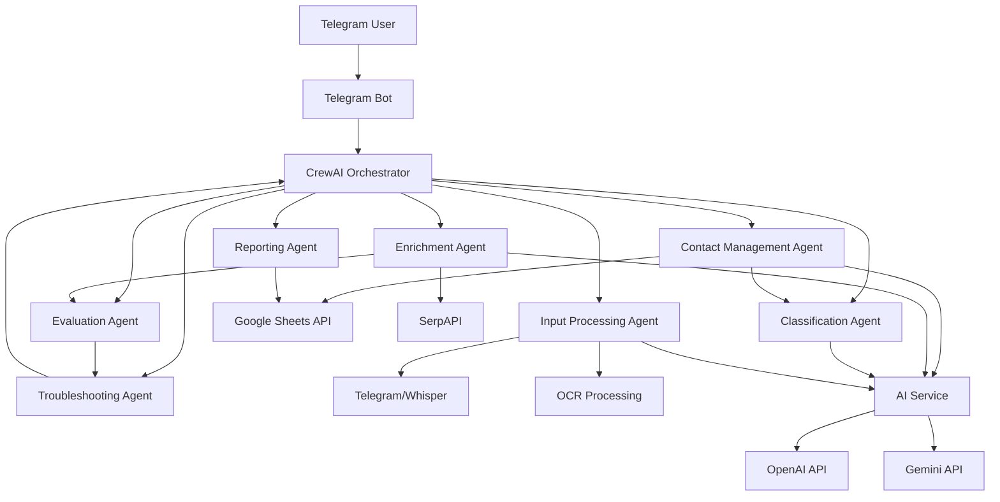

# Telegram Network Nurturing Agent - Implementation Plan

## Architecture Overview

The bot will be built using Python with `python-telegram-bot` and `CrewAI` for agentic orchestration. CrewAI enables role-based AI agents that collaborate on complex tasks, with built-in evaluation and troubleshooting capabilities. The architecture uses CrewAI agents for specialized roles, orchestrated through crews and flows.



## Core Features

### 1. Contact Management

- **Add Contact**: Extract information from natural language, voice, image, or bulk input
- **Update Contact**: Modify existing contact fields
- **View Contact**: Retrieve and display contact information
- **Delete Contact**: Remove contacts (with confirmation)

### 2. Data Enrichment

- **Auto-enrich**: Search for contact's LinkedIn, company info, recent news
- **Manual enrich**: On-demand enrichment via command
- **Company research**: Gather company information, funding, team size

### 3. Input Processing

- **Text**: Natural language parsing for contact information
- **Voice**: Transcription via Telegram API (primary) and OpenAI Whisper (fallback)
- **Image**: OCR using OpenAI Vision API to extract business cards/text
- **Bulk**: CSV/text file imports with parsing

### 4. Reporting & Analytics

- **Contact statistics**: Count by job title, location, company, classification
- **Contact reports**: Detailed view with all available information
- **Search contacts**: Find contacts by name, company, or attribute
- **Export**: Generate CSV reports

### 5. Classification

- **Auto-classify**: AI-powered classification as founder, investor, enabler, or professional
- **Manual override**: Allow user to set/change classification
- **Classification confidence**: Display confidence scores

### 6. Evaluation & Quality Assurance

- **Data quality evaluation**: Automatic assessment of contact data completeness and accuracy
- **Missing information detection**: Identify gaps in contact information
- **Data validation**: Validate email, phone, LinkedIn URLs automatically
- **Quality scores**: Provide data quality scores for contacts
- **Improvement recommendations**: Suggest ways to improve contact data quality

### 7. Troubleshooting & Error Handling

- **Automatic error detection**: Identify errors and exceptions in operations
- **Root cause analysis**: Diagnose issues systematically
- **Error resolution**: Attempt to resolve common issues automatically
- **Error logging**: Comprehensive logging for debugging
- **Preventive measures**: Implement safeguards to prevent error recurrence

### 8. Evaluation & Testing Interface

- **Operation tracking**: Track all operations (success/failure) with timestamps
- **Success/failure analytics**: Monitor which operations succeed and fail
- **Performance metrics**: Track execution times, API response times, error rates
- **Usage analytics**: Monitor feature usage, most common operations, user patterns
- **Real-time dashboard**: Telegram commands to view analytics and reports
- **Operation history**: View history of all operations with details
- **Error analytics**: Analyze failure patterns and root causes

### 9. Logging & Change Tracking

- **Feature change log**: Log every feature addition, modification, and removal
- **Operation logs**: Comprehensive logging of all operations
- **Agent activity logs**: Track agent actions and decisions
- **Error logs**: Detailed error logging with stack traces
- **Audit trail**: Complete audit trail of all system changes
- **Change history**: Viewable history of feature changes with timestamps
- **Technical logs**: Technical logs for debugging and troubleshooting

### 10. Technical Documentation

- **API documentation**: Document all APIs, services, and tools
- **Agent documentation**: Document agent roles, goals, and behaviors
- **Crew documentation**: Document crew workflows and orchestration
- **Tool documentation**: Document all CrewAI tools and their usage
- **Architecture documentation**: System architecture and design decisions
- **Setup guide**: Installation and configuration instructions
- **Usage guide**: User guide with examples
- **Developer guide**: Guide for extending and modifying the system

### 11. Additional Features

- **Follow-up reminders**: Set reminders for network follow-ups
- **Notes**: Add notes/meeting notes to contacts
- **Tags**: Add custom tags for better organization
- **Duplicate detection**: Alert when adding duplicate contacts
- **Agent orchestration**: Seamless collaboration between specialized agents
- **Task delegation**: Automatic task delegation to appropriate agents
- **Context preservation**: Maintain conversation context across agent interactions

## File Structure

```
/Users/ahmedabaza/Rover_Network_agent/
├── main.py                          # Entry point, bot initialization
├── config.py                        # Configuration and environment variables
├── .env                            # API keys and secrets (gitignored)
├── requirements.txt                 # Python dependencies
├── README.md                        # Setup and usage instructions
├── .gitignore                      # Git ignore file
│
├── agents/
│   ├── __init__.py
│   ├── contact_agent.py            # CrewAI agent for contact management
│   ├── enrichment_agent.py         # CrewAI agent for data enrichment
│   ├── input_agent.py              # CrewAI agent for input processing
│   ├── reporting_agent.py          # CrewAI agent for reporting and analytics
│   ├── classification_agent.py     # CrewAI agent for contact classification
│   ├── evaluation_agent.py         # CrewAI agent for data evaluation
│   └── troubleshooting_agent.py    # CrewAI agent for error handling
│
├── crews/
│   ├── __init__.py
│   ├── contact_crew.py             # Crew for contact operations
│   ├── enrichment_crew.py          # Crew for enrichment workflows
│   ├── input_processing_crew.py    # Crew for input processing
│   └── reporting_crew.py           # Crew for reporting tasks
│
├── tools/
│   ├── __init__.py
│   ├── google_sheets_tool.py       # CrewAI tool for Google Sheets operations
│   ├── serpapi_tool.py             # CrewAI tool for SerpAPI searches
│   ├── ai_tool.py                  # CrewAI tool for AI operations
│   ├── validation_tool.py          # CrewAI tool for data validation
│   └── transcription_tool.py       # CrewAI tool for voice transcription
│
├── services/
│   ├── __init__.py
│   ├── google_sheets.py            # Google Sheets API integration
│   ├── enrichment.py               # SerpAPI enrichment service
│   ├── ai_service.py               # OpenAI/Gemini integration
│   ├── classification.py           # Contact classification logic
│   └── transcription.py            # Voice transcription handling
│
├── handlers/
│   ├── __init__.py
│   ├── contact_handlers.py         # Telegram handlers for contact commands
│   ├── enrichment_handlers.py      # Telegram handlers for enrichment
│   ├── report_handlers.py          # Telegram handlers for reporting
│   ├── input_handlers.py           # Telegram handlers for voice/image/bulk
│   ├── conversation_handlers.py    # Natural language conversation flow
│   ├── analytics_handlers.py       # Telegram handlers for analytics
│   └── evaluation_handlers.py      # Telegram handlers for evaluation interface
│
├── analytics/
│   ├── __init__.py
│   ├── tracker.py                  # Operation tracking service
│   ├── metrics.py                  # Metrics collection and calculation
│   ├── usage_analytics.py          # Usage analytics service
│   └── performance_monitor.py      # Performance monitoring
│
├── logging/
│   ├── __init__.py
│   ├── logger.py                   # Centralized logging service
│   ├── operation_logger.py         # Operation-specific logging
│   ├── agent_logger.py             # Agent activity logging
│   ├── error_logger.py             # Error logging with stack traces
│   └── change_logger.py            # Feature change logging
│
├── interfaces/
│   ├── __init__.py
│   ├── evaluation_interface.py     # Evaluation and testing interface
│   ├── analytics_interface.py      # Analytics interface for viewing metrics
│   └── dashboard.py                # Dashboard for real-time monitoring
│
├── utils/
│   ├── __init__.py
│   ├── parsers.py                  # Parse contact info from text/voice
│   ├── validators.py               # Validate email, phone, URLs
│   ├── formatters.py               # Format messages and data
│   └── constants.py                # Constants and enums
│
├── data/
│   ├── schema.py                   # Google Sheets column definitions
│   └── storage.py                  # Data storage abstraction
│
├── docs/
│   ├── README.md                   # Main documentation index
│   ├── ARCHITECTURE.md             # Architecture documentation
│   ├── API.md                      # API documentation
│   ├── AGENTS.md                   # Agent documentation
│   ├── CREWS.md                    # Crew workflows documentation
│   ├── TOOLS.md                    # Tool documentation
│   ├── SETUP.md                    # Setup and installation guide
│   ├── USAGE.md                    # User guide with examples
│   ├── DEVELOPER.md                # Developer guide
│   ├── CHANGELOG.md                # Feature change log
│   └── TROUBLESHOOTING.md          # Troubleshooting guide
│
└── logs/
    ├── operations.log              # Operation logs (gitignored)
    ├── agents.log                  # Agent activity logs (gitignored)
    ├── errors.log                  # Error logs (gitignored)
    ├── changes.log                 # Feature change logs (gitignored)
    └── analytics.db                # Analytics database (SQLite) (gitignored)
```

## CrewAI Agent Architecture

### Agent Roles and Responsibilities

The system uses CrewAI agents with specialized roles, goals, and backstories for better task orchestration and evaluation.

#### 1. Contact Management Agent (`agents/contact_agent.py`)

- **Role**: Data Entry Specialist
- **Goal**: Accurately add, update, and manage contact information in Google Sheets
- **Backstory**: Expert in contact management with attention to detail and data validation
- **Tools**: Google Sheets Tool, Validation Tool
- **Responsibilities**:
  - Add new contacts with complete information
  - Update existing contact fields
  - Retrieve and display contact information
  - Detect duplicates
  - Validate data integrity

#### 2. Enrichment Agent (`agents/enrichment_agent.py`)

- **Role**: Research Specialist
- **Goal**: Enrich contact data through online searches and gather comprehensive information
- **Backstory**: Skilled researcher with expertise in finding and verifying professional information
- **Tools**: SerpAPI Tool, AI Tool
- **Responsibilities**:
  - Search for contact's LinkedIn profile
  - Research company information
  - Find recent news and updates
  - Gather additional professional details
  - Verify and cross-reference information

#### 3. Input Processing Agent (`agents/input_agent.py`)

- **Role**: Data Extraction Specialist
- **Goal**: Extract structured contact information from various input formats
- **Backstory**: Expert in parsing and extracting structured data from unstructured sources
- **Tools**: Transcription Tool, AI Tool (OCR), Validation Tool
- **Responsibilities**:
  - Process voice messages and transcribe
  - Extract data from images (business cards, documents)
  - Parse natural language text
  - Handle bulk imports (CSV, text files)
  - Structure extracted data for storage

#### 4. Classification Agent (`agents/classification_agent.py`)

- **Role**: Categorization Specialist
- **Goal**: Accurately classify contacts into appropriate categories
- **Backstory**: Expert in professional categorization with understanding of business roles
- **Tools**: AI Tool, Validation Tool
- **Responsibilities**:
  - Classify contacts as founder, investor, enabler, or professional
  - Determine classification confidence scores
  - Review and update classifications
  - Provide classification reasoning

#### 5. Reporting Agent (`agents/reporting_agent.py`)

- **Role**: Analytics Specialist
- **Goal**: Generate comprehensive reports and statistics about contacts
- **Backstory**: Expert in data analysis and reporting with attention to accuracy
- **Tools**: Google Sheets Tool, AI Tool
- **Responsibilities**:
  - Generate contact statistics by attributes
  - Create detailed contact reports
  - Export data in various formats
  - Provide insights and analytics

#### 6. Evaluation Agent (`agents/evaluation_agent.py`)

- **Role**: Quality Assurance Specialist
- **Goal**: Evaluate data quality, completeness, and accuracy
- **Backstory**: Expert in data quality assessment with high standards
- **Tools**: Validation Tool, Google Sheets Tool
- **Responsibilities**:
  - Evaluate contact data completeness
  - Assess data quality and accuracy
  - Identify missing or incomplete information
  - Provide improvement recommendations
  - Validate enriched data accuracy

#### 7. Troubleshooting Agent (`agents/troubleshooting_agent.py`)

- **Role**: Problem Resolution Specialist
- **Goal**: Identify and resolve errors, issues, and inconsistencies
- **Backstory**: Expert in debugging and problem-solving with systematic approach
- **Tools**: All tools (access to diagnose issues)
- **Responsibilities**:
  - Identify errors and exceptions
  - Diagnose root causes
  - Suggest and implement fixes
  - Log issues for analysis
  - Prevent error recurrence

### Crew Orchestration

#### Contact Crew (`crews/contact_crew.py`)

- **Purpose**: Handle contact management workflows
- **Agents**: Contact Management Agent, Classification Agent, Evaluation Agent
- **Process**: Sequential workflow with evaluation step
- **Tasks**: Add/Update/View/Delete contacts with validation and classification

#### Enrichment Crew (`crews/enrichment_crew.py`)

- **Purpose**: Enrich contact data through research
- **Agents**: Enrichment Agent, Evaluation Agent, Troubleshooting Agent
- **Process**: Parallel enrichment with evaluation and error handling
- **Tasks**: Search, enrich, validate, and update contact information

#### Input Processing Crew (`crews/input_processing_crew.py`)

- **Purpose**: Process various input types
- **Agents**: Input Processing Agent, Contact Management Agent, Evaluation Agent
- **Process**: Extract → Structure → Validate → Store
- **Tasks**: Process voice, image, text, or bulk inputs

#### Reporting Crew (`crews/reporting_crew.py`)

- **Purpose**: Generate reports and analytics
- **Agents**: Reporting Agent, Evaluation Agent
- **Process**: Aggregate → Analyze → Format → Present
- **Tasks**: Generate statistics, reports, and exports

### CrewAI Tools

CrewAI tools are wrappers around services that agents can use:

#### Google Sheets Tool (`tools/google_sheets_tool.py`)

- Wrapper around Google Sheets service
- Methods: add_contact, update_contact, get_contact, search_contacts
- Input validation and error handling

#### SerpAPI Tool (`tools/serpapi_tool.py`)

- Wrapper around SerpAPI enrichment service
- Methods: search_person, search_company, get_linkedin_profile
- Result parsing and formatting

#### AI Tool (`tools/ai_tool.py`)

- Wrapper around OpenAI/Gemini services
- Methods: classify, parse, extract_from_image, transcribe
- LLM orchestration with fallback

#### Validation Tool (`tools/validation_tool.py`)

- Data validation utilities
- Methods: validate_email, validate_phone, validate_url, validate_data
- Comprehensive validation rules

#### Transcription Tool (`tools/transcription_tool.py`)

- Voice transcription service
- Methods: transcribe_voice_message
- Multiple provider support (Telegram API, Whisper)

## Implementation Details

### [config.py](config.py)

- Load environment variables from `.env`
- Validate required API keys are present
- Google Sheets credentials setup (service account or OAuth)
- Bot configuration constants

### [services/google_sheets.py](services/google_sheets.py)

- Initialize Google Sheets client using `gspread` library
- Methods: `add_contact()`, `update_contact()`, `get_contact()`, `list_contacts()`, `search_contacts()`
- Auto-detect or create sheet structure with columns: Name, Job Title, Company, Phone, Email, LinkedIn, Location, Tags, Classification, Notes, Last Contacted, Created Date
- Handle sheet permissions and authentication

### [services/enrichment.py](services/enrichment.py)

- SerpAPI integration for web searches
- Methods: `enrich_contact()`, `search_company()`, `search_person()`, `get_linkedin_profile()`
- Parse search results and extract relevant information
- Merge enriched data with existing contact data

### [services/ai_service.py](services/ai_service.py)

- OpenAI API for general AI tasks (classification, parsing, OCR)
- Gemini API as alternative/fallback
- Methods: `classify_contact()`, `parse_contact_info()`, `extract_from_image()`, `transcribe_audio()`
- Handle rate limiting and API errors gracefully

### [services/classification.py](services/classification.py)

- Classification logic using AI service
- Categories: founder, investor, enabler, professional
- Rules-based classification as backup
- Store classification confidence scores

### [handlers/contact_handlers.py](handlers/contact_handlers.py)

- `/add` command: Add new contact with interactive prompts or natural language
- `/update <name>`: Update existing contact fields
- `/view <name>`: Display contact information
- `/delete <name>`: Delete contact (with confirmation)
- `/list`: List all contacts with pagination
- `/search <query>`: Search contacts by name, company, or attribute

### [handlers/enrichment_handlers.py](handlers/enrichment_handlers.py)

- `/enrich <name>`: Enrich specific contact with online search
- Auto-enrich option when adding contacts
- `/research <company>`: Research company information

### [handlers/report_handlers.py](handlers/report_handlers.py)

- `/stats`: Show overall statistics
- `/stats by <attribute>`: Statistics filtered by job, location, company, classification
- `/report <name>`: Generate detailed contact report
- `/export`: Export contacts to CSV (sent as file)

### [handlers/input_handlers.py](handlers/input_handlers.py)

- Voice message handler: Download, transcribe, parse
- Image handler: OCR extraction, parse contact info
- Document handler: Parse CSV/text files for bulk imports
- Natural language handler: Parse free-form text for contact info

### [handlers/conversation_handlers.py](handlers/conversation_handlers.py)

- Conversation state management for multi-step interactions
- Interactive contact creation flow
- Context-aware responses using conversation history

### [utils/parsers.py](utils/parsers.py)

- `parse_contact_from_text()`: Extract structured data from natural language
- `parse_contact_from_voice()`: Process transcribed voice
- `parse_contact_from_image()`: Extract from OCR results
- Use regex and AI service for parsing

### [utils/validators.py](utils/validators.py)

- Email validation
- Phone number formatting and validation
- LinkedIn URL validation
- URL validation

### CrewAI Agents Implementation

#### [agents/contact_agent.py](agents/contact_agent.py)

- Create CrewAI Agent with role: "Data Entry Specialist"
- Define goal: "Accurately add, update, and manage contact information"
- Assign tools: GoogleSheetsTool, ValidationTool
- Configure verbose mode for debugging
- Set allow_delegation: False (specialized agent)

#### [agents/enrichment_agent.py](agents/enrichment_agent.py)

- Create CrewAI Agent with role: "Research Specialist"
- Define goal: "Enrich contact data through online searches"
- Assign tools: SerpAPITool, AITool
- Configure for web search tasks
- Set allow_delegation: False

#### [agents/input_agent.py](agents/input_agent.py)

- Create CrewAI Agent with role: "Data Extraction Specialist"
- Define goal: "Extract structured contact information from various formats"
- Assign tools: TranscriptionTool, AITool (OCR), ValidationTool
- Handle multiple input types
- Set allow_delegation: False

#### [agents/classification_agent.py](agents/classification_agent.py)

- Create CrewAI Agent with role: "Categorization Specialist"
- Define goal: "Accurately classify contacts into appropriate categories"
- Assign tools: AITool, ValidationTool
- Configure classification logic
- Set allow_delegation: False

#### [agents/reporting_agent.py](agents/reporting_agent.py)

- Create CrewAI Agent with role: "Analytics Specialist"
- Define goal: "Generate comprehensive reports and statistics"
- Assign tools: GoogleSheetsTool, AITool
- Configure for data analysis tasks
- Set allow_delegation: False

#### [agents/evaluation_agent.py](agents/evaluation_agent.py)

- Create CrewAI Agent with role: "Quality Assurance Specialist"
- Define goal: "Evaluate data quality, completeness, and accuracy"
- Assign tools: ValidationTool, GoogleSheetsTool
- Configure evaluation criteria
- Set allow_delegation: False

#### [agents/troubleshooting_agent.py](agents/troubleshooting_agent.py)

- Create CrewAI Agent with role: "Problem Resolution Specialist"
- Define goal: "Identify and resolve errors, issues, and inconsistencies"
- Assign tools: All tools (access to diagnose)
- Configure error handling logic
- Set allow_delegation: True (can delegate to other agents)

### CrewAI Crews Implementation

#### [crews/contact_crew.py](crews/contact_crew.py)

- Create Crew with agents: ContactAgent, ClassificationAgent, EvaluationAgent
- Define process: Process.sequential (or Process.hierarchical)
- Configure tasks for add/update/view/delete operations
- Set verbose mode for debugging
- Implement error handling with TroubleshootingAgent

#### [crews/enrichment_crew.py](crews/enrichment_crew.py)

- Create Crew with agents: EnrichmentAgent, EvaluationAgent, TroubleshootingAgent
- Define process: Process.sequential with parallel enrichment
- Configure tasks for search and enrich workflows
- Handle API rate limiting and retries

#### [crews/input_processing_crew.py](crews/input_processing_crew.py)

- Create Crew with agents: InputAgent, ContactAgent, EvaluationAgent
- Define process: Process.sequential
- Configure tasks for voice/image/text/bulk processing
- Implement validation pipeline

#### [crews/reporting_crew.py](crews/reporting_crew.py)

- Create Crew with agents: ReportingAgent, EvaluationAgent
- Define process: Process.sequential
- Configure tasks for statistics and reporting
- Format output for Telegram

### CrewAI Tools Implementation

#### [tools/google_sheets_tool.py](tools/google_sheets_tool.py)

- Extend CrewAI Tool class
- Implement tool description for agent context
- Wrap Google Sheets service methods
- Handle errors and return formatted results
- Input/output schema validation

#### [tools/serpapi_tool.py](tools/serpapi_tool.py)

- Extend CrewAI Tool class
- Implement search methods with SerpAPI
- Parse and format search results
- Handle rate limiting and errors

#### [tools/ai_tool.py](tools/ai_tool.py)

- Extend CrewAI Tool class
- Implement AI operations (classification, parsing, OCR)
- Support OpenAI and Gemini APIs
- Handle API fallback logic

#### [tools/validation_tool.py](tools/validation_tool.py)

- Extend CrewAI Tool class
- Implement validation methods
- Return validation results with error details
- Support multiple validation rules

#### [tools/transcription_tool.py](tools/transcription_tool.py)

- Extend CrewAI Tool class
- Implement voice transcription
- Support Telegram API (primary) and Whisper (fallback)
- Handle audio file processing

### Analytics & Tracking Implementation

#### [analytics/tracker.py](analytics/tracker.py)

- Track all operations with metadata: operation_type, status (success/failure), timestamp, duration, agent_name, crew_name, error_message
- Store operation records in SQLite database or log file
- Methods: `track_operation()`, `get_operation_history()`, `get_operations_by_status()`, `get_operations_by_type()`
- Integration points: All handlers, crews, and agents
- Automatic tracking decorators for easy integration

#### [analytics/metrics.py](analytics/metrics.py)

- Calculate success/failure rates by operation type
- Calculate average execution times
- Calculate error rates by category
- Generate performance metrics: throughput, latency, error rates
- Methods: `calculate_success_rate()`, `calculate_avg_duration()`, `calculate_error_rate()`, `get_performance_metrics()`
- Time-series metrics for trend analysis

#### [analytics/usage_analytics.py](analytics/usage_analytics.py)

- Track feature usage: which commands are used most, which agents are most active
- Track user patterns: peak usage times, most common workflows
- Track operation frequency: how often each operation is performed
- Methods: `track_feature_usage()`, `get_feature_stats()`, `get_user_patterns()`, `get_operation_frequency()`
- Generate usage reports and insights

#### [analytics/performance_monitor.py](analytics/performance_monitor.py)

- Monitor system performance: CPU, memory usage, API response times
- Track API rate limiting and quota usage
- Monitor agent performance: execution times, success rates
- Methods: `monitor_performance()`, `get_performance_stats()`, `track_api_usage()`, `get_api_quota_status()`
- Alert on performance degradation

### Logging Implementation

#### [logging/logger.py](logging/logger.py)

- Centralized logging configuration with multiple log levels (DEBUG, INFO, WARNING, ERROR, CRITICAL)
- Structured logging with JSON format for easy parsing
- Log rotation to prevent log files from growing too large
- Methods: `get_logger()`, `configure_logging()`, `log_operation()`, `log_error()`
- Integration with standard Python logging module

#### [logging/operation_logger.py](logging/operation_logger.py)

- Log all operations with detailed metadata
- Track operation lifecycle: start, progress, completion, failure
- Log operation context: user, command, parameters, result
- Methods: `log_operation_start()`, `log_operation_progress()`, `log_operation_complete()`, `log_operation_failure()`
- Structured format for easy querying

#### [logging/agent_logger.py](logging/agent_logger.py)

- Log agent activities: actions, decisions, tool usage
- Track agent interactions: which agents collaborate, delegation patterns
- Log agent reasoning and thought process (if available)
- Methods: `log_agent_action()`, `log_agent_decision()`, `log_agent_tool_usage()`, `log_agent_interaction()`
- Agent-specific log files for better organization

#### [logging/error_logger.py](logging/error_logger.py)

- Comprehensive error logging with stack traces
- Error categorization: API errors, validation errors, system errors
- Error context: operation, agent, crew, input data
- Methods: `log_error()`, `log_exception()`, `get_error_summary()`, `analyze_error_patterns()`
- Error aggregation and analysis

#### [logging/change_logger.py](logging/change_logger.py)

- Log all feature changes: additions, modifications, removals
- Track code changes: version, date, author, description
- Log configuration changes: environment variables, API keys, settings
- Methods: `log_feature_add()`, `log_feature_modify()`, `log_feature_remove()`, `get_change_history()`
- Generate CHANGELOG.md automatically

### Evaluation & Testing Interface Implementation

#### [interfaces/evaluation_interface.py](interfaces/evaluation_interface.py)

- Telegram commands for evaluation: `/eval_stats`, `/eval_operations`, `/eval_errors`
- Display success/failure rates, operation statistics, error summaries
- Real-time evaluation metrics in Telegram messages
- Methods: `get_evaluation_stats()`, `get_operation_summary()`, `get_error_summary()`, `format_evaluation_report()`
- Interactive evaluation reports with inline keyboards

#### [interfaces/analytics_interface.py](interfaces/analytics_interface.py)

- Telegram commands for analytics: `/analytics`, `/usage_stats`, `/performance`
- Display usage statistics, feature usage, performance metrics
- Generate analytics reports and export data
- Methods: `get_usage_stats()`, `get_feature_usage()`, `get_performance_metrics()`, `format_analytics_report()`
- Visualizations using text-based charts (ASCII) or formatted tables

#### [interfaces/dashboard.py](interfaces/dashboard.py)

- Dashboard command: `/dashboard` for comprehensive overview
- Real-time monitoring: active operations, system status, recent errors
- Key metrics display: success rate, error rate, average response time
- Methods: `generate_dashboard()`, `get_system_status()`, `get_recent_activity()`, `format_dashboard()`
- Periodic updates and alerts for critical issues

### Telegram Handlers for Analytics & Evaluation

#### [handlers/analytics_handlers.py](handlers/analytics_handlers.py)

- `/analytics` - Show overall analytics and usage statistics
- `/analytics operations` - Show operation success/failure statistics
- `/analytics features` - Show feature usage statistics
- `/analytics performance` - Show performance metrics
- `/analytics export` - Export analytics data as CSV/JSON

#### [handlers/evaluation_handlers.py](handlers/evaluation_handlers.py)

- `/eval` - Show evaluation statistics and summaries
- `/eval operations` - Evaluate specific operations
- `/eval errors` - Show error analysis and patterns
- `/eval quality` - Show data quality metrics
- `/eval agents` - Show agent performance evaluation

### Technical Documentation Implementation

#### [docs/ARCHITECTURE.md](docs/ARCHITECTURE.md)

- System architecture overview with diagrams
- Component descriptions and relationships
- Data flow diagrams
- Agent orchestration patterns
- Design decisions and rationale

#### [docs/API.md](docs/API.md)

- API documentation for all services
- Service methods with parameters and return types
- Example usage for each service
- Error handling and exceptions
- Integration patterns

#### [docs/AGENTS.md](docs/AGENTS.md)

- Agent documentation: roles, goals, backstories
- Agent responsibilities and capabilities
- Agent-to-agent interaction patterns
- Agent tool usage
- Agent configuration and customization

#### [docs/CREWS.md](docs/CREWS.md)

- Crew workflows and orchestration patterns
- Task definitions and execution order
- Crew composition and agent selection
- Process types: sequential, hierarchical, parallel
- Crew configuration examples

#### [docs/TOOLS.md](docs/TOOLS.md)

- Tool documentation for all CrewAI tools
- Tool input/output schemas
- Tool usage examples
- Tool integration patterns
- Custom tool development guide

#### [docs/CHANGELOG.md](docs/CHANGELOG.md)

- Auto-generated from change logs
- Feature additions, modifications, removals
- Version history with dates and authors
- Migration guides for breaking changes
- Links to related documentation

#### [docs/TROUBLESHOOTING.md](docs/TROUBLESHOOTING.md)

- Common issues and solutions
- Error codes and meanings
- Debugging procedures
- Performance optimization tips
- FAQ section

### [main.py](main.py)

- Initialize Telegram bot with token
- Initialize CrewAI agents and crews
- Initialize analytics tracker and performance monitor
- Initialize logging services and configure loggers
- Register command handlers that use CrewAI crews
- Register analytics and evaluation handlers
- Register message handlers (voice, image, text) with crew orchestration
- Set up conversation handlers with agent context
- Error handling with TroubleshootingAgent integration
- Operation tracking and logging for all operations
- Start polling with crew execution and monitoring

## Google Sheets Structure

**Sheet: "Contacts"** (or auto-detect existing structure)

Columns:

- Name
- Job Title
- Company
- Phone
- Email
- LinkedIn URL
- Location
- Classification (founder/investor/enabler/professional)
- Tags (comma-separated)
- Notes
- Last Contacted (date)
- Created Date (timestamp)
- Enriched Data (JSON or separate columns)
- Source (text/voice/image/bulk)

## Analytics Database Structure

**SQLite Database: `analytics.db`**

### Operations Table

- `id` (INTEGER PRIMARY KEY)
- `operation_type` (TEXT) - add_contact, update_contact, enrich_contact, etc.
- `status` (TEXT) - success, failure
- `timestamp` (TIMESTAMP)
- `duration_ms` (INTEGER) - execution time in milliseconds
- `agent_name` (TEXT) - which agent executed the operation
- `crew_name` (TEXT) - which crew orchestrated the operation
- `user_id` (TEXT) - Telegram user ID
- `command` (TEXT) - Telegram command used
- `error_message` (TEXT) - error details if failed
- `error_type` (TEXT) - API error, validation error, system error
- `input_data` (JSON) - operation input parameters
- `output_data` (JSON) - operation results

### Feature Usage Table

- `id` (INTEGER PRIMARY KEY)
- `feature_name` (TEXT) - command or feature name
- `usage_count` (INTEGER)
- `last_used` (TIMESTAMP)
- `user_id` (TEXT)
- `success_count` (INTEGER)
- `failure_count` (INTEGER)

### Agent Activity Table

- `id` (INTEGER PRIMARY KEY)
- `agent_name` (TEXT)
- `action` (TEXT) - action performed
- `tool_used` (TEXT) - which tool was used
- `timestamp` (TIMESTAMP)
- `duration_ms` (INTEGER)
- `success` (BOOLEAN)
- `operation_id` (INTEGER) - foreign key to operations table

### Error Log Table

- `id` (INTEGER PRIMARY KEY)
- `error_type` (TEXT)
- `error_message` (TEXT)
- `stack_trace` (TEXT)
- `timestamp` (TIMESTAMP)
- `operation_id` (INTEGER)
- `agent_name` (TEXT)
- `resolved` (BOOLEAN)
- `resolution` (TEXT)

### Feature Changes Table

- `id` (INTEGER PRIMARY KEY)
- `change_type` (TEXT) - added, modified, removed
- `feature_name` (TEXT)
- `description` (TEXT)
- `version` (TEXT)
- `timestamp` (TIMESTAMP)
- `author` (TEXT)
- `files_changed` (JSON) - list of files modified

## Additional Features

### Contact Management

1. **Follow-up Reminders**: `/remind <name> <date>` - Set reminders for follow-ups
2. **Notes Management**: `/note <name> <note>` - Add notes to contacts
3. **Tags System**: `/tag <name> <tag1,tag2>` - Add tags for organization
4. **Duplicate Detection**: Alert when email/phone already exists
5. **Help System**: Comprehensive `/help` with all commands
6. **Quick Actions**: Inline keyboard buttons for common actions
7. **Bulk Operations**: Batch updates and imports
8. **Data Backup**: Periodic backup of sheet data

### Evaluation & Testing Interface

1. **Dashboard**: `/dashboard` - Real-time monitoring of system status, active operations, recent errors
2. **Evaluation Stats**: `/eval` - Show overall evaluation statistics and summaries
3. **Operation Evaluation**: `/eval operations` - Evaluate specific operations with success/failure breakdown
4. **Error Analysis**: `/eval errors` - Show error analysis, patterns, and root causes
5. **Quality Metrics**: `/eval quality` - Show data quality metrics and scores
6. **Agent Performance**: `/eval agents` - Show agent performance evaluation and statistics

### Analytics & Reporting

1. **Analytics Overview**: `/analytics` - Show overall analytics and usage statistics
2. **Operation Analytics**: `/analytics operations` - Show operation success/failure statistics
3. **Feature Usage**: `/analytics features` - Show feature usage statistics and patterns
4. **Performance Metrics**: `/analytics performance` - Show performance metrics and system health
5. **Export Data**: `/analytics export` - Export analytics data as CSV/JSON file

### Monitoring & Alerts

1. **Real-time Monitoring**: Dashboard updates with current system status
2. **Error Alerts**: Notifications when critical errors occur
3. **Performance Alerts**: Warnings when performance degrades
4. **Quota Monitoring**: Track API quota usage and alert when approaching limits
5. **Operation Status**: Real-time status of ongoing operations

## Dependencies

### Core Framework

- `python-telegram-bot` (v20+): Telegram bot framework
- `crewai` (latest): AI agent orchestration framework
- `crewai-tools`: Additional tools for CrewAI

### API Integrations

- `gspread`: Google Sheets API client
- `google-auth`: Google authentication
- `openai`: OpenAI API client
- `google-generativeai`: Gemini API client
- `serpapi`: SerpAPI client for web searches

### Data Processing

- `pandas`: Data manipulation for reports
- `Pillow`: Image processing for OCR
- `pydub`: Audio processing for voice messages
- `regex`: Pattern matching for parsing

### Analytics & Logging

- `sqlite3`: Built-in SQLite database for analytics (Python standard library)
- `logging`: Built-in logging framework (Python standard library)
- `datetime`: Built-in date/time handling (Python standard library)
- `json`: Built-in JSON handling (Python standard library)

### Utilities

- `python-dotenv`: Environment variable management
- `langchain`: LLM orchestration (CrewAI dependency)
- `pydantic`: Data validation (CrewAI dependency)
- `tabulate`: Format tables for analytics reports (optional)

## Security Considerations

- Store all API keys in `.env` file (not committed to git)
- Use Google service account with limited permissions
- Validate and sanitize all user inputs
- Rate limiting for API calls
- Error handling without exposing sensitive information
- Logging for debugging without logging sensitive data

## Analytics & Evaluation Integration

### Operation Tracking Integration

All operations are automatically tracked with metadata:

- **Handler Level**: Every Telegram command handler tracks operation start/end
- **Crew Level**: Crew execution is tracked with agent composition and task flow
- **Agent Level**: Individual agent actions are logged with tool usage
- **Service Level**: Service method calls are tracked with parameters and results

### Analytics Collection Points

1. **Command Handlers**: Track which commands are used, success/failure rates
2. **Crew Execution**: Track crew performance, execution times, agent collaboration
3. **Agent Actions**: Track agent tool usage, decision-making patterns
4. **Service Calls**: Track API calls, response times, error rates
5. **User Interactions**: Track user patterns, peak usage times, common workflows

### Evaluation Interface Features

- **Real-time Monitoring**: `/dashboard` command shows current system status
- **Operation Statistics**: `/eval operations` shows success/failure breakdown
- **Error Analysis**: `/eval errors` shows error patterns and root causes
- **Performance Metrics**: `/analytics performance` shows system performance
- **Usage Analytics**: `/analytics usage` shows feature usage patterns
- **Export Capabilities**: Export analytics data for external analysis

### Logging Integration

- **Automatic Logging**: All operations, errors, and agent activities are automatically logged
- **Structured Format**: JSON-structured logs for easy parsing and analysis
- **Log Levels**: Different log levels (DEBUG, INFO, WARNING, ERROR, CRITICAL) for filtering
- **Log Rotation**: Automatic log rotation to prevent disk space issues
- **Centralized Logging**: All logs are centralized in the logs/ directory
- **Change Tracking**: Feature changes are automatically logged to changes.log

### Feature Change Logging

The system automatically logs:

- **Code Changes**: When new features are added or modified
- **Configuration Changes**: When settings or API keys are updated
- **Agent Changes**: When agent roles, goals, or tools are modified
- **Crew Changes**: When crew compositions or workflows are updated
- **Tool Changes**: When tools are added, modified, or removed

Changes are logged with:

- Timestamp
- Change type (added, modified, removed)
- Feature name and description
- Version number
- Author information
- Files changed

## CrewAI Benefits

### Agentic Orchestration

- **Specialized Roles**: Each agent has a focused role with expertise in specific tasks
- **Task Delegation**: Agents can delegate tasks to appropriate specialists
- **Parallel Processing**: Crews can execute tasks in parallel when possible
- **Workflow Management**: Structured workflows (sequential, hierarchical) for complex operations
- **Performance Tracking**: All agent and crew activities are tracked for performance analysis

### Evaluation & Quality Assurance

- **Built-in Evaluation**: CrewAI provides evaluation mechanisms to assess agent performance
- **Data Quality Scoring**: EvaluationAgent automatically scores data quality and completeness
- **Feedback Loop**: Evaluation results inform agent improvements
- **Validation Pipeline**: Automatic validation at multiple stages
- **Operation Analytics**: Track evaluation operations and their effectiveness

### Troubleshooting & Error Handling

- **Automatic Error Detection**: TroubleshootingAgent monitors operations for errors
- **Root Cause Analysis**: Systematic diagnosis of issues
- **Self-Healing**: Attempts to resolve common issues automatically
- **Comprehensive Logging**: Detailed logs for debugging and improvement
- **Error Analytics**: Track error patterns and resolution success rates

### Context & Memory

- **Agent Memory**: Agents maintain context across interactions
- **Shared Context**: Crew members share relevant context
- **Conversation History**: Preserve context for better understanding
- **Knowledge Base**: Agents can reference previous interactions
- **Operation History**: Track historical operations for context and learning

## Technical Documentation Maintenance

### Automatic Documentation Generation

- **CHANGELOG.md**: Auto-generated from change logs stored in the database
- **API Documentation**: Generate from docstrings using tools like Sphinx or MkDocs
- **Agent Documentation**: Extract agent configurations and generate documentation
- **Workflow Diagrams**: Generate diagrams from crew configurations

### Documentation Structure

- **README.md**: Main entry point with quick start guide
- **ARCHITECTURE.md**: System architecture, design decisions, component relationships
- **API.md**: Complete API reference for all services and tools
- **AGENTS.md**: Agent documentation with roles, goals, capabilities
- **CREWS.md**: Crew workflows, orchestration patterns, task definitions
- **TOOLS.md**: Tool documentation with usage examples
- **SETUP.md**: Detailed installation and configuration guide
- **USAGE.md**: User guide with examples and use cases
- **DEVELOPER.md**: Guide for extending and modifying the system
- **CHANGELOG.md**: Version history with feature changes
- **TROUBLESHOOTING.md**: Common issues, solutions, and debugging guide

### Documentation Best Practices

- Keep documentation up-to-date with code changes
- Include examples and use cases
- Provide diagrams for complex concepts
- Include code snippets for common operations
- Document configuration options and environment variables
- Maintain version history and migration guides

## Testing Approach

### Unit Testing

- Parsing and validation functions
- Individual service methods
- Utility functions
- Analytics calculation functions
- Logging formatters

### Integration Testing

- Google Sheets operations with test sheet
- CrewAI agent tests with mock tools
- Crew workflow tests with sample data
- Analytics tracking with test database
- Logging system with test log files

### System Testing

- End-to-end workflows: contact addition, enrichment, reporting
- Error scenarios: API failures, validation errors, system errors
- Performance testing: load testing, response time measurement
- Analytics accuracy: verify tracked metrics match actual operations
- Logging completeness: verify all operations are logged correctly

### Evaluation Testing

- Evaluation agent tests for quality assessment
- Troubleshooting agent tests for error scenarios
- Analytics interface tests for correct data display
- Dashboard functionality tests
- Operation tracking accuracy tests

### Mock Services

- Mock API responses for external services (SerpAPI, OpenAI, Gemini)
- Mock Google Sheets API for testing without actual sheet access
- Mock Telegram API for testing handlers without actual bot
- Mock database for analytics testing

### Test Data

- Sample contacts for testing operations
- Sample voice files for transcription testing
- Sample images for OCR testing
- Sample bulk import files (CSV, text)
- Sample error scenarios for testing error handling

### Continuous Testing

- Automated tests on code changes
- Performance regression testing
- Analytics accuracy validation
- Documentation link validation
- Code coverage reports

## Deployment

- Can run on any server with Python 3.8+
- Consider using systemd service for Linux
- Environment variables for configuration
- Optional: Docker containerization

## Evaluation & Troubleshooting Mechanisms

### Automatic Evaluation

- **Data Completeness Score**: EvaluationAgent checks required fields and completeness
- **Data Accuracy Validation**: Cross-reference data with enrichment results
- **Classification Confidence**: Assess classification confidence scores
- **Quality Metrics**: Calculate overall quality scores for contacts
- **Missing Field Detection**: Identify required fields that are missing

### Troubleshooting Workflow

1. **Error Detection**: TroubleshootingAgent monitors operations for errors
2. **Error Classification**: Categorize errors (API errors, validation errors, data errors)
3. **Root Cause Analysis**: Analyze error logs and context to identify root causes
4. **Resolution Strategies**: Apply appropriate fixes based on error type
5. **Prevention Measures**: Implement safeguards to prevent recurrence

### Error Handling Strategies

- **API Errors**: Retry with exponential backoff, fallback to alternative APIs
- **Validation Errors**: Return detailed error messages, suggest corrections
- **Data Errors**: Flag issues for review, provide recommendations
- **Network Errors**: Retry mechanisms, offline mode capabilities
- **Rate Limiting**: Queue requests, implement rate limit handling

## Future Enhancements

### CrewAI Enhancements

- **Agent Learning**: Implement agent learning from past interactions
- **Dynamic Crew Formation**: Create crews dynamically based on task requirements
- **Agent Specialization**: Further specialize agents for niche tasks
- **Performance Monitoring**: Track agent performance and optimize
- **A/B Testing**: Test different agent configurations

### Feature Enhancements

- Multi-user support with authentication and user-specific crews
- Webhook instead of polling for better scalability
- Database integration for better performance (with CrewAI tool)
- Integration with CRM systems (Salesforce, HubSpot)
- Automated follow-up email sending (via EmailAgent)
- Meeting calendar integration (via CalendarAgent)
- Advanced analytics with dedicated AnalyticsAgent
- Predictive features for contact engagement